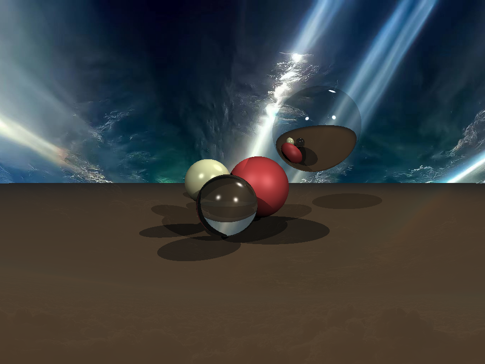

# Ray Tracing

This project is an exploration of ray tracing, a rendering technique for generating realistic images by simulating the way light interacts with objects. The goal of this project is to generate a single frame (an image) using ray tracing techniques.



## Features

- Learn and implement the fundamentals of ray tracing.
- Generate a single frame demonstrating ray tracing concepts.

## Getting Started
To build and run the project, run the following command:

```sh
zig build run
```

## References
- [Ray tracing (graphics)](https://en.wikipedia.org/wiki/Ray_tracing_(graphics))
- [Part 1: understandable raytracing](https://github.com/ssloy/tinyraytracer/wiki/Part-1:-understandable-raytracing)

## License
This project is licensed under the MIT License. See the [LICENSE](LICENSE) file for details.